## 风暴之书（Storm Book）— 微信小游戏

一款纵版飞行射击（STG）小游戏。基于微信飞机大战魔改，支持移动端触摸操控、任务进度系统、客机护航与货机补给、Boss 多阶段弹幕战、僚机与多级火力成长、导弹与轰炸清屏等经典要素。

### 预览图

### 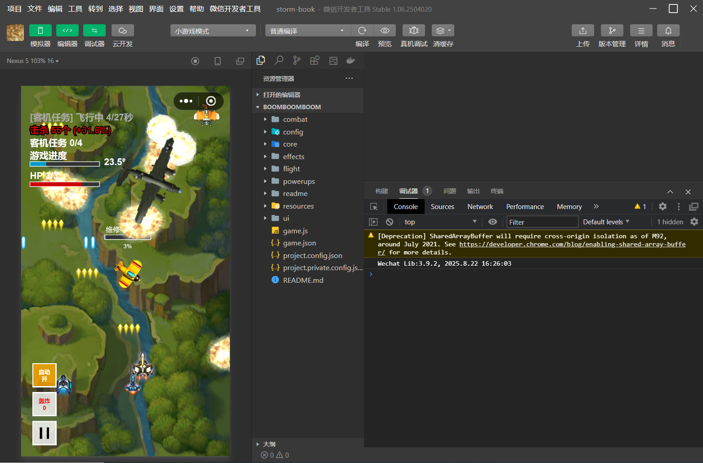

玩家： 

敌机与 Boss：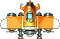 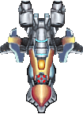 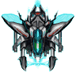 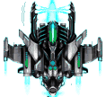 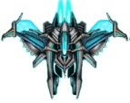

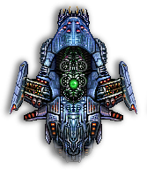 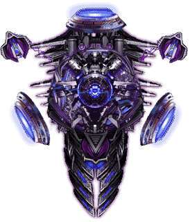 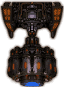 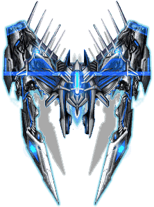 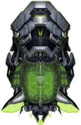 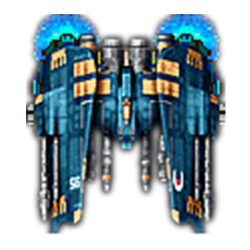 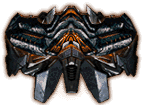

爆炸特效：

 

道具/补给与导弹：

    

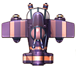 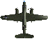  

僚机与 UI：

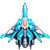 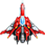  

---

## 玩法概述

- **核心目标**: 在不断推进的关卡中击毁敌机，护送客机安全撤离，收集货机掉落的补给道具，完成阶段性任务，挑战 Boss 弹幕战。
- **成长系统**: 收集道具获得双倍火力、僚机、追踪导弹、轰炸清屏、生命补给等；子弹数量等级 1→2→4→8→10，达到最强后回到 2 并提升威力等级（tier）。
- **任务/进度**: 每局随机 1–5 个任务段。击杀、客机推进共同驱动进度，进度条有平滑动画；完成全部任务进入胜利结算。
- **难度曲线**: 基于击杀数的对数函数逐步提高敌机强度与 Boss 体量，兼顾强者爽感与稳定节奏。

## 如何游玩

- **平台**: 微信小游戏
- **操作**: 手指按住屏幕拖动战机移动；点击界面按钮可暂停/使用技能
- **目标**: 击落敌机、护送客机安全通过、收集货机补给，完成所有任务
- **提示**: 推荐开启音效，沉浸感更强！

## 游戏特色

- 一指上手：拖动即可精准走位与闪避
- 爽快成长：火力从 1→10，再回到 2 同时威力升级，越打越强
- 僚机护航：最多 2 架僚机并肩作战，自动开火
- 任务推进：击杀+护送共同推进关卡进度，完成全部任务赢得胜利
- 炫目演出：Boss 多阶段弹幕、震屏、爆炸与动感音效

## 关键玩法机制

- **玩家成长**
  - 子弹数量等级：1→2→4→8→10→（回到 2，威力 tier+1）
  - 双倍火力永久解锁：首次升级后，至少维持双发
  - 生命耗尽仅掉一条命并重置数量等级，威力等级保留（形成“永久成长感”）
  - 僚机最多 2 架，3 级成长，自动随主机射击

- **道具/补给**（动态生成条件示例）
  - 生命补给：生命≤2 时才出现
  - 追踪导弹：未处于导弹模式时才生成
  - 轰炸清屏：当局未持有时才生成（用于即时清屏与危机解围）
  - 战斗僚机：僚机等级未满时出现
  - 双倍火力：随时可能出现，是经典爽点来源

- **导弹/轰炸**
  - 导弹具备锁定、转向与寿命机制；爆炸具范围伤害与屏幕震动反馈
  - 轰炸（清屏）通过 `powerupManager.clearScreen()` 触发，清除威胁并配合特效/音效

- **敌机与 Boss**
  - 敌机类型：small（不射击，速度快）、medium（不射击，体积/威胁更高）、large（上方悬停后低频射击）、boss（多阶段弹幕）
  - Boss 弹幕（部分）：固定圆周、多层条状快速旋转、长时螺旋单向旋转、风车甩弹、交叉对称弹、环形复数甩弹、米弹、双向长时旋转、变速旋转（波/粒子）

  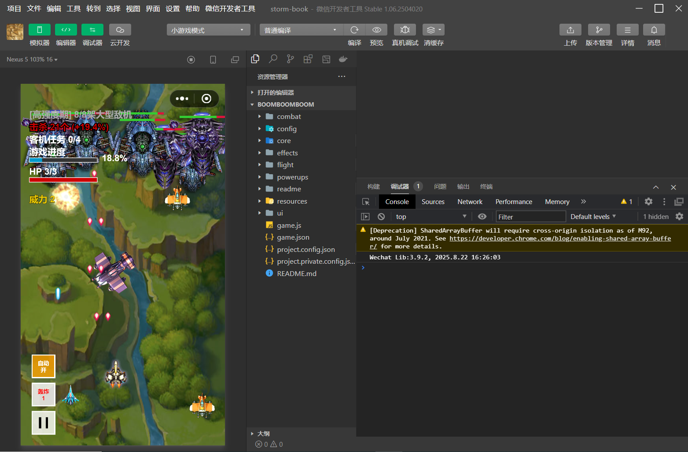
  
- **任务与进度**
  - 每局随机分配 1–5 段任务
  - 进度由击杀（阶梯权重）+ 客机推进共同组成，进度条具平滑动画
  - 完成全部任务 → `mission_complete` → 胜利

## Boss 弹幕设计

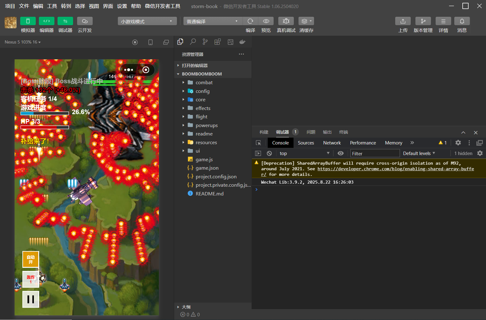

Boss 拥有多阶段、多样化弹幕，战斗中会在短暂间歇后切换模式。以下为主要样式：

- 固定圆周（同心多圈）
  - 形态：一瞬间在机体周围生成若干同心圈，整圈子弹向外扩散，层与层之间有固定间距。
  - 节奏：一次性铺满后进入短暂空窗，再切下一套弹幕。
  - 应对：就近找“圈与圈之间”的缝，沿切线微移穿过；不要贪向内回拉，避免被内圈追上。

- 快速旋转（条状双阶段）
  - 形态：两条或三条“子弹条带”围绕 Boss 快速旋转，半程后反向再旋转一次。
  - 节奏：前后两段各持续约一小段时间，中间有极短调整期。
  - 应对：贴外圈绕开条带，注意方向切换的瞬间先停、再观察新方向后移动。

- 螺旋单向（长时间）
  - 形态：单向持续喷出螺旋线，角速度较快。
  - 节奏：持续时间较长，整体压迫力来自“越绕越密”。
  - 应对：与旋转同方向作小半径滑步，比逆向更省位移；实在被逼近就反切穿缝。

- 风车甩弹（2–3 臂）
  - 形态：两到三条“风车臂”甩出成串子弹，臂间形成扇区空白。
  - 节奏：甩动有节拍，越外层子弹速度略快、体积略小，视觉上像向外散开的光束。
  - 应对：提前站在两个“臂”之间的扇区，等臂扫过后顺势切到下一个扇区。

- 交叉对称（镜像）
  - 形态：一组从 Boss 本体发射，另一组从屏幕对称点同时打出，构成交叉网格。
  - 节奏：多轮短促爆发，后有间歇。
  - 应对：少走屏幕正中“对射线”，选择斜向 45° 的扇区更安全；别直线往回拉。

- 复数甩弹（环形扫射）
  - 形态：按多个等分方向发射，并带少量甩动偏移，形成缓慢旋转的环状扫射。
  - 节奏：稳定推进型压制。
  - 应对：顺着甩动方向作切向滑步，小角度持续挪位比大步穿越更稳。

- 双向旋转（长时双阶段）
  - 形态：先长时间朝一个方向螺旋，随后切换到反方向继续。
  - 节奏：切换时机固定但前后时长不完全相同。
  - 应对：留意方向切换的过渡帧，先停半拍再决定绕行方向，避免和旋转迎面相撞。

- 变速旋转（“波与粒子”）
  - 形态：多条射线型弹幕随时间加速→减速，偶尔出现反向，整体像“呼吸”般脉动。
  - 节奏：速度周期性起伏，末段可能突然反向。
  - 应对：加速期最危险，提前让出通道；当速度明显降下来要警惕反向，预留回旋空间。

通用建议：
- 远离屏幕边缘，给自己留下二次调整空间
- 看“整体流向”而非盯单颗，优先沿切线小幅挪移
- 有清屏时机（轰炸）别犹豫，尤其在切换节拍衔接不顺时
- 先保命再输出，等间歇/低速窗口再贴近输出

## 小贴士

- 刚开局火力较弱，优先收集“双倍火力”“僚机”提升输出
- 危险时使用“轰炸”清屏保命；导弹可自动追踪高威胁目标
- 护送客机成功能大幅推进任务进度

## 版本与更新

- 持续优化手感与平衡性，新增任务与弹幕样式，欢迎收藏与反馈

## 资源画廊（更多）

- 乘客机护航：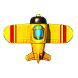  
- 备用/占位素材：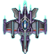 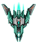  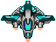 

## 反馈

- 有任何建议或问题，欢迎在仓库 Issue 留言，或在小游戏内评价区反馈

## 常见问题（FAQ）

- 进度为什么不动？击落敌机与护送客机都会推进进度，注意别错过补给
- 火力为什么掉了？阵亡后数量等级会重置，但威力等级保留，继续变强
